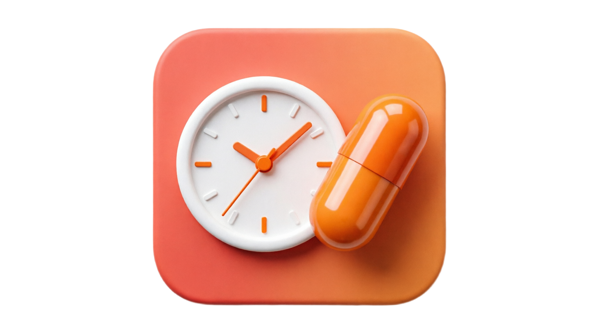

# 💊 AU MedTraker



**AU MedTraker** — мобильное приложение для отслеживания приёма лекарств

## ✨ Возможности

- 📋 **Расписание на сегодня** — просмотр всех запланированных приёмов, отсортированных по времени
- 🆘 **Лекарства «По надобности»** — приём препаратов с возможностью многократного использования и отмены
- 📊 **Статистика** — прогресс лечению за неделю и месяц, текущая серия дней
- 🗓️ **Тепловая карта** — визуальный обзор приёмов за 60 и 90 дней
- 👆 **Навигация свайпами** — листайте дни влево-вправо
- ➕ **Управление лекарствами** — добавление, редактирование, архивирование, завершение курса
- 🌗 **Темы оформления** — светлая/тёмная тема с тёплой коралловой палитрой
- 📦 **Архив** — просмотр завершённых и архивированных препаратов
---

## 🗂 Структура проекта

```
lib/
└── src/
    ├── database/
    │   ├── daos/              # DAO-слой (работа с БД)
    │   └── tables/            # Определения таблиц
    ├── providers/             # Riverpod-провайдеры
    ├── router/                # GoRouter-маршрутизация
    ├── screens/
    │   ├── dosage/         # История дозировок
    │   │   ├── widgets/       # Виджеты экрана дозировок
    │   │   └── ...
    │   ├── logs/              # Редактирование логов
    │   ├── medications/    # Список и добавление лекарств
    │   │   ├── widgets/       # Виджеты экранов лекарств
    │   │   └── ...
    │   ├── statistics/     # Статистика и тепловая карта
    │   │   ├── widgets/       # Виджеты экрана статистики
    │   │   └── ...
    │   └── today/          # Главный экран «Сегодня»
    │       ├── widgets/       # Виджеты главного экрана
    │       └── ...
    ├── services/              # Сервисы (уведомления и пр.)
    ├── shared/                # Общие утилиты
    ├── theme/                 # Дизайн-токены и тема оформления
    └── widgets/               # Переиспользуемые виджеты (общие)
```

## 🎨 Дизайн-система

Проект использует кастомную дизайн-систему на базе `ThemeExtension`:

### Токены (`lib/src/theme/`)

| Файл | Назначение |
|---|---|
| `app_color_tokens.dart` | Цветовые токены для light/dark темы. Доступ через `context.appColors`. |
| `app_radius.dart` | Радиусы скругления (карточки 18px, кнопки 12px, чипы 50px). |
| `app_shadows.dart` | Тени для карточек и кнопок (3 уровня: малая/средняя/большая). |
| `app_gradients.dart` | Градиенты для primary-кнопок, прогресс-баров, декоративных элементов. |
| `app_animations.dart` | Длительности (100/200/300/500ms) и кривые анимаций. |
| `app_theme.dart` | Сборка `ThemeData` из токенов + `AppColors` (цвета аватарок лекарств) + `MedicationIcons`. |

### Палитра

- **Светлая тема**: тёплый персиковый фон `#FFF5F0`, коралловый акцент `#FF8C69`
- **Тёмная тема**: глубокий тёмный фон `#0A0908`, мягкий коралловый акцент `#FF9F7A`
- **Статусы**: зелёный (успех), оранжевый (предупреждение), красный (ошибка), синий (информация)

## 🛠 Технологии

| Технология | Назначение |
|---|---|
| **Flutter** 3.12+ (Material 3) | Сами придумайте зачем |
| **Drift** | SQLite ORM |
| **Riverpod** | Управление состоянием |
| **GoRouter** | Маршрутизация |
| **forui** | UI-компоненты (date/time picker) |

## 🚀 Установка

```bash
git clone https://github.com/Kto0-to/au-med.git
cd au-med
flutter pub get
flutter run
```
---
## 🗺 В планах

- ⏰ **Уведомления** — напоминания о приёме лекарств
- 💊 **Разные дозировки** — запись разного времени и разных доз
- 📁 **Архив с историей** — возврат archived-препаратов с сохранением истории
